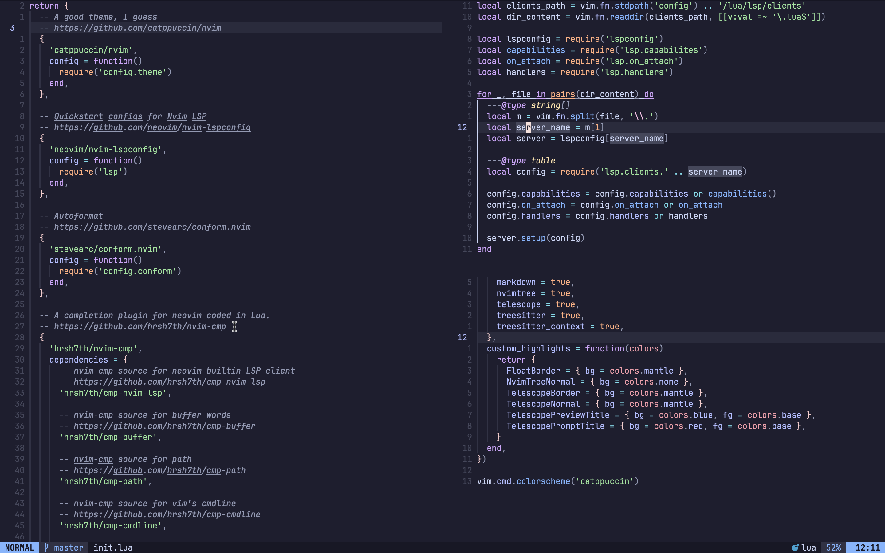

## ssiyad/neovim
This repository contains my personal Neovim configuration. It is intentionally
minimal in functional and aesthetic aspects. Feel free to use it as a base for
your own setup.

## Features
- Plugin management using `lazy.nvim`.
- Clean configuration with Lua modules.
- LSP and autocomplete support.
- Telescope for fuzzy finding.
- Treesitter for syntax highlighting.
- Oil as file explorer.



## Installation
### Prerequisites
- Neovim (v0.8+ recommended)
- Git

### Steps
```sh
git clone https://github.com/ssiyad/nvim ~/.config/nvim
```
Launch Neovim and run `:Lazy sync` (or the equivalent for your plugin manager) to install plugins.

## Contributing
Feel free to submit issues or pull requests to enhance the configuration.
